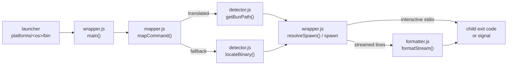

# Architecture

One short-lived process per invocation: no daemon, no shared state. A launcher
in `bunpm/platforms/<os>/bin/` runs `core/wrapper.js` with the manager name and
the untouched arguments; the wrapper then spawns at most one child: Bun or the
original manager.

## Request flow

1. A launcher in `bunpm/platforms/<os>/bin/` (or the `bunpm` bin) runs
   `core/wrapper.js <manager> [args...]`. `wrapper.js doctor` runs
   `core/doctor.js` instead.
2. `mapper.js` validates the arguments and returns Bun arguments or a fallback.
3. `detector.js` resolves Bun (translated) or the original manager (fallback)
   from absolute PATH entries.
4. `wrapper.js` checks the spawn in `resolveSpawn` and starts one child.
   Interactive commands inherit the terminal; others stream through
   `formatter.js` line by line, with SIGINT/SIGTERM forwarded to the child.
5. The child's exit status is returned unchanged; a signal becomes
   `128 + signo`. bunpm's own failures print `bunpm: <component>: <message>`
   and exit 1.

## Modules

- [`core/wrapper.js`](bunpm/core/wrapper.js): entry point. Validates every
  spawn in `resolveSpawn` (absolute executable, argument array, `shell: false`;
  a generic Windows `.cmd`/`.bat` shim runs through an explicit `cmd.exe` and
  rejects shell-sensitive arguments), streams output, returns the exit code.
- [`core/mapper.js`](bunpm/core/mapper.js): pure command and flag tables that
  return Bun arguments or a fallback. No I/O. Ambiguity always resolves to
  fallback, never a guess.
- [`core/detector.js`](bunpm/core/detector.js): finds Bun and the original
  managers on absolute PATH entries (then `~/.bun/bin`), skipping bunpm's own
  copies and empty or relative entries.
- [`core/doctor.js`](bunpm/core/doctor.js): `bunpm doctor` health checks
  (Node.js floor, Bun, launchers, original managers).
- [`core/formatter.js`](bunpm/core/formatter.js): line-by-line cosmetic rewrite
  of non-interactive Bun output.

## Boundaries

[`bootstrap.js`](bunpm/bootstrap.js) ([Remote Bootstrap](README.md#remote-bootstrap)) and the platform installers run once, by
hand, and are never imported by the wrapper. Bootstrap imports nothing from
`core/` because those files are not downloaded yet when it starts.

Trust boundaries: bunpm runs whatever Bun and original managers your absolute
PATH entries resolve to, without validating them. Only `bootstrap.js` performs
network I/O, restricted to this repository at one commit SHA; child processes
reach registries under their own configuration. Installers write only under
`~/.bunpm`, one shell profile, or Windows User PATH. bunpm's own failures are
always `bunpm: <component>: <message>` on stderr; set `BUNPM_DEBUG=1` to get an
extra JSON line (`level`, `component`, `message`, `code`) per failure.

Observability: bunpm is a one-shot process with no daemon or port, so it has no
logging backend, metrics or health endpoint. Its exit code and the stderr lines
above (plus `BUNPM_DEBUG`) are the whole diagnostic surface. See
[SECURITY.md](SECURITY.md) to report a vulnerability.
