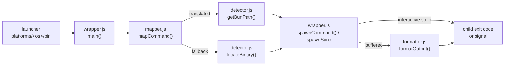

# bunpm

A small wrapper that routes a supported subset of `npm`, `npx`, `yarn`, and
`pnpm` commands through [Bun](https://bun.sh). Plain CommonJS JavaScript, Node
built-ins only, and zero runtime dependencies. No build step or service.

## Requirements

- Node.js 16.9+ for runtime; Node.js 22.13+ and Bun 1.3.14 for development.
- Bun installed separately for translated commands.
- The original package manager installed for fallback commands.
- Windows PowerShell/CMD, or Bash on macOS/Linux. The CI matrix executes native
  smoke tests on all three operating systems; a green local Windows run alone
  does not establish macOS/Linux support.

## Install From Source

Review the checkout before running its installer. No dependency install is needed
to use bunpm. The installer copies only runtime files into your home `.bunpm`
directory. It refuses to overwrite an existing installation.

Windows PowerShell, from the repository root:

```powershell
powershell -NoProfile -ExecutionPolicy Bypass -File bunpm/platforms/windows/scripts/install.ps1
```

macOS:

```sh
bash bunpm/platforms/macos/scripts/install.sh
```

Linux:

```sh
bash bunpm/platforms/linux/scripts/install.sh
```

Restart your terminal. Unix setup updates the first existing supported shell
profile (or creates `.zprofile` on macOS / `.bashrc` on Linux) without adding a
duplicate bunpm PATH entry. Windows setup changes **User PATH only** and treats
case, quotes, and trailing separators as the same existing bunpm PATH entry;
System PATH can still precede it. To activate in the current PowerShell session
explicitly:

```powershell
$env:PATH = "$env:USERPROFILE\.bunpm\bin;$env:PATH"
```

Use `-NoPath` on Windows or `--no-path` on Unix for manual PATH management.
Original manager binaries are never replaced. To bypass bunpm, call an original
binary by its absolute path or remove `.bunpm/bin` from the current session PATH.

## Remote Bootstrap

Prefer a reviewed source checkout. For standalone downloading, retrieve
`bunpm/bootstrap.js` from a **specific 40-character commit SHA**, inspect it, and
run it with that **same SHA**:

```sh
node bootstrap.js --revision <40-character-commit-sha>
```

The bootstrap downloads only this repository's runtime files at that revision.
It enforces HTTPS, same-repository/same-revision redirects, a five-redirect limit,
a 15-second total deadline per file, and a 1 MiB per-file size limit. Failed or
empty downloads are not executed; private temporary download files are cleaned.
This is transport and revision consistency, **not** a signature or independently
trusted checksum scheme. GitHub, the selected commit, Node, Bun, and local PATH
executables remain trust boundaries. Do not run unreviewed remote code.

## Commands And Limits

- `npm install` maps to `bun install`; `npm install pkg` to `bun add pkg`.
- `yarn add pkg` and `pnpm add pkg` map to `bun add pkg`.
- Common remove/update/list/why/link commands are mapped where supported.
- `npm run build`, `yarn run build`, and `pnpm run build` use `bun run build`.
- `npm test` and `pnpm test` run the package's test script via `bun run test`,
  not Bun's built-in test runner. Script arguments are preserved.
- Package-first `npx pkg` and `yarn/pnpm dlx pkg` use `bun x pkg`, inheriting
  the terminal for interactive prompts. Package-manager-specific exec options
  fall back instead of being guessed.
- Version requests use the **original manager**, never a fabricated version.
  `npm version patch` likewise stays native.
- Unknown commands/options, `npm ci`, `init`, `exec`, publish/auth/audit/config,
  Yarn shorthand and pnpm workspace filtering fall back to the original manager.
- If Bun is missing, supported commands also fall back. A missing original manager
  yields a diagnostic and nonzero exit, not a silent success.
- Failures after Bun starts are not retried: a second manager could repeat
  mutations. Exit statuses and signal-derived failures are preserved.

This is **not a fully compatible package-manager replacement**. Bun controls
lockfile, dependency layout, lifecycle, registry and workspace semantics for
translated commands. pnpm's strict dependency isolation and Yarn PnP behavior are
not preserved. Use the original manager when these distinctions matter.

Install output receives a small manager-style transformation; unknown lines and
errors remain visible. Interactive script/package execution inherits stdio.
Buffered non-interactive output is limited to 16 MiB. No performance multiplier,
security audit, or quality score is implied by successful installation.

On Windows, known npm/npx/Yarn/pnpm Node entrypoints are spawned directly with
argument arrays. Other `.cmd`/`.bat` shims reject shell-sensitive characters rather
than risking injection. Use the original Node CLI entrypoint for such arguments.
Empty and relative PATH entries are intentionally ignored during discovery.

## Uninstall And Update

Windows:

```powershell
powershell -NoProfile -ExecutionPolicy Bypass -File "$env:USERPROFILE\.bunpm\scripts\uninstall.ps1"
```

macOS/Linux:

```sh
bash "$HOME/.bunpm/scripts/uninstall.sh"
```

Use the same no-PATH option if you managed PATH yourself. Uninstall removes the
runtime directory and bunpm's exact PATH entries, preserving unrelated profile
lines. It leaves Bun and original package managers installed. Restart the terminal
to discard its old environment. To update, uninstall, review the new checkout,
then install again. No background updater runs.

## Architecture And Boundaries

One short-lived wrapper process per invocation: no daemon, no shared state, no
build step. A launcher in `bunpm/platforms/<os>/bin/` runs `core/wrapper.js` with
the invoked manager name and the untouched argument list. Everything below is a
plain CommonJS function call in that wrapper process, which then spawns at most
one child process: Bun, or the original manager.



- [`bunpm/core/wrapper.js`](bunpm/core/wrapper.js) — entry point: decides,
  spawns without a shell, prints, and returns the child's exit status. Also
  holds the `diagnose` stderr helper.
- [`bunpm/core/mapper.js`](bunpm/core/mapper.js) — pure command/flag tables.
  Returns either Bun arguments or a fallback instruction. No I/O.
- [`bunpm/core/detector.js`](bunpm/core/detector.js) — resolves Bun and the
  original managers from absolute PATH entries, skipping bunpm's own copies.
- [`bunpm/core/formatter.js`](bunpm/core/formatter.js) — line-by-line cosmetic
  rewrite of buffered Bun output only.
- [`bunpm/core/platform-detect.js`](bunpm/core/platform-detect.js) — the only
  place that maps `process.platform` to paths under `~/.bunpm`.

Two components sit outside that per-command path and are used once, by hand:
[`bunpm/bootstrap.js`](bunpm/bootstrap.js) downloads runtime files at a pinned
revision and then hands off to an installer, and the platform installers in
[`bunpm/platforms`](bunpm/platforms) copy files and edit PATH. Neither is
imported by the wrapper; bootstrap deliberately imports nothing from `core/`
because those files do not exist yet when it starts.

`mapCommand` decides between two outcomes. **Translated** commands have a
documented Bun equivalent and run through Bun, so Bun owns their lockfile and
dependency semantics. **Fallback** commands — unknown commands or options, and
anything whose semantics cannot be reproduced safely — run the original manager
with the original arguments. Ambiguity always resolves to fallback rather than a
guess, which is why the mapper is a table and not a heuristic.

Fallback happens only _before_ a child mutates anything: a missing or
non-executable binary (`ENOENT`/`EACCES`) is retried once with the original
manager. Once Bun has started, no failure is retried, because a second manager
could repeat a partially applied install. Exit codes pass through unchanged and
signals become `128 + signo`.

Trust boundaries: bunpm executes whatever Bun and the original managers your
absolute PATH entries resolve to, and never validates their contents. It adds
no registry, network access, or credentials of its own at run time.
`bootstrap.js` is the only bunpm component that performs network I/O, restricted
to this repository at one immutable commit SHA (see
[Remote Bootstrap](#remote-bootstrap)); the Bun and original-manager child
processes reach whatever registries the invoked command needs, under their own
configuration. Installers write only under `~/.bunpm`, one shell profile, or
Windows User PATH. bunpm's own failures are always
`bunpm: <component>: <message>` on stderr; anything else on stderr came from the
child.

## Development

See [CONTRIBUTING.md](CONTRIBUTING.md) for frozen installs, offline tests,
production coverage gates, lint, format, audit, syntax and smoke commands.
See [CHANGELOG.md](CHANGELOG.md) for compatibility and security changes.

## License

MIT License

Copyright (c) 2026 THE YV

Permission is hereby granted, free of charge, to any person obtaining a copy
of this software and associated documentation files (the "Software"), to deal
in the Software without restriction, including without limitation the rights
to use, copy, modify, merge, publish, distribute, sublicense, and/or sell
copies of the Software, and to permit persons to whom the Software is
furnished to do so, subject to the following conditions:

The above copyright notice and this permission notice shall be included in all
copies or substantial portions of the Software.

THE SOFTWARE IS PROVIDED "AS IS", WITHOUT WARRANTY OF ANY KIND, EXPRESS OR
IMPLIED, INCLUDING BUT NOT LIMITED TO THE WARRANTIES OF MERCHANTABILITY,
FITNESS FOR A PARTICULAR PURPOSE AND NONINFRINGEMENT. IN NO EVENT SHALL THE
AUTHORS OR COPYRIGHT HOLDERS BE LIABLE FOR ANY CLAIM, DAMAGES OR OTHER
LIABILITY, WHETHER IN AN ACTION OF CONTRACT, TORT OR OTHERWISE, ARISING FROM,
OUT OF OR IN CONNECTION WITH THE SOFTWARE OR THE USE OR OTHER DEALINGS IN THE
SOFTWARE.
