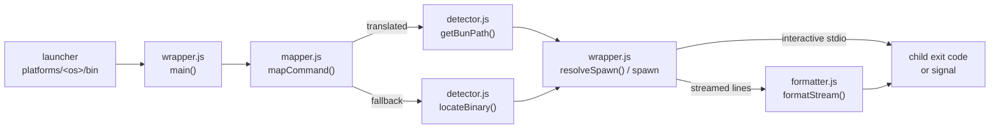

# bunpm

**Project type:** Standalone Node.js CLI tool and package manager wrapper. It is
not a backend service or infrastructure project: no Terraform, Kubernetes,
Helm, Pulumi, Ansible or containers.

A small wrapper that routes a supported subset of `npm`, `npx`, `yarn` and
`pnpm` commands through [Bun](https://bun.sh), and falls back to the original
manager whenever a command cannot be translated safely. Plain CommonJS, Node
built-ins only, zero runtime dependencies, no build step.

## Requirements

- Node.js 16.9+ to run bunpm; Node.js 22.13+ and Bun 1.3.14 to develop it.
- Bun for translated commands, and the original manager for fallback commands.
- PowerShell/CMD on Windows, or Bash on macOS/Linux. CI runs native smoke tests
  on all three.
- No secrets or configuration. [`.env.example`](.env.example) lists the only
  variables bunpm reads: `PATH`, `WINDIR`/`SystemRoot` (both provided by the
  OS) and the optional `BUNPM_DEBUG`.

## Install From Source

Review the checkout, then run the installer for your OS from the repository
root. It copies only runtime files into `~/.bunpm` and refuses to overwrite an
existing installation.

```powershell
# Windows
powershell -NoProfile -ExecutionPolicy Bypass -File bunpm/platforms/windows/scripts/install.ps1
```

```sh
bash bunpm/platforms/macos/scripts/install.sh   # macOS
bash bunpm/platforms/linux/scripts/install.sh   # Linux
```

Restart your terminal. Unix setup adds one marked PATH line to the first
existing shell profile (or creates `.zprofile` on macOS / `.bashrc` on Linux);
Windows setup changes **User PATH only**. Pass `-NoPath` (Windows) or
`--no-path` (Unix) to manage PATH yourself. Original manager binaries are never
replaced; call one by absolute path to bypass bunpm.

## Remote Bootstrap

Prefer a reviewed checkout. To install without one, download
`bunpm/bootstrap.js` from a **specific 40-character commit SHA**, inspect it,
and run it with that **same SHA**:

```sh
node bootstrap.js --revision <40-character-commit-sha>
```

It downloads only this repository's runtime files at that revision over HTTPS,
allows only same-repository, same-revision redirects (at most five), and limits
each file to 15 seconds and 1 MiB. Partial or empty downloads are never run.
This checks transport and revision consistency; it is **not** a signature
scheme. Do not run unreviewed remote code.

## Commands And Limits

- `npm install` maps to `bun install`; `npm install pkg`, `yarn add pkg` and
  `pnpm add pkg` map to `bun add pkg`. Common remove/update/list/why/link
  commands are mapped too.
- `npm run build` (and the yarn/pnpm forms) and `npm test` run `bun run <script>`
  with script arguments preserved. Options after the script name
  (`npm test --watch`) are npm's own config, so they fall back; pass script
  options after `--`.
- Package-first `npx pkg` and `yarn/pnpm dlx pkg` use `bun x pkg` with the
  terminal inherited.
- Everything else falls back to the original manager: unknown commands or
  options, options with an explicit `=value` (except `--registry`), `npm ci`,
  `init`, `exec`, `version`, publish/auth/audit/config, Yarn shorthand and pnpm
  workspace filtering. Supported commands also fall back when Bun is missing.
- Non-interactive output is reformatted to look like the invoked manager and
  streamed line by line with no size limit. It is piped, so Bun prints no
  colors or progress bars. Unknown lines and errors pass through unchanged.
- A failure after Bun has started is never retried, because a second manager
  could repeat a partial install. Exit statuses pass through; signals become
  `128 + signo`.

bunpm is **not** a fully compatible package-manager replacement: Bun controls
lockfile, layout, lifecycle, registry and workspace semantics for translated
commands, and pnpm isolation and Yarn PnP are not preserved. Use the original
manager when that matters.

## Check An Installation

```sh
node ~/.bunpm/core/wrapper.js doctor   # or `bunpm doctor` after npm link
```

It prints one line per check (Node.js 16.9+, Bun found and `bun --version`
works, launchers present, original managers found) and exits 1 if any required
check fails, with the reason on stderr.

## Uninstall And Update

```powershell
powershell -NoProfile -ExecutionPolicy Bypass -File "$env:USERPROFILE\.bunpm\scripts\uninstall.ps1"
```

```sh
bash "$HOME/.bunpm/scripts/uninstall.sh"
```

Uninstall removes `~/.bunpm` and bunpm's exact PATH entries, keeping unrelated
profile lines, Bun and the original managers. To update, uninstall, review the
new checkout and install again. There is no background updater.

## Architecture And Boundaries

One short-lived process per invocation: no daemon, no shared state. A launcher
in `bunpm/platforms/<os>/bin/` runs `core/wrapper.js` with the manager name and
the untouched arguments; the wrapper then spawns at most one child: Bun or the
original manager.


```mermaid
flowchart LR
  L["launcher<br/>platforms/&lt;os&gt;/bin"] --> W["wrapper.js<br/>main()"]
  W --> M["mapper.js<br/>mapCommand()"]
  M -->|translated| B["detector.js<br/>getBunPath()"]
  M -->|fallback| O["detector.js<br/>locateBinary()"]
  B --> X["wrapper.js<br/>resolveSpawn() / spawn"]
  O --> X
  X -->|streamed lines| F["formatter.js<br/>formatStream()"]
  X -->|interactive stdio| E["child exit code<br/>or signal"]
  F --> E
```

- [`core/wrapper.js`](bunpm/core/wrapper.js): entry point. Validates every
  spawn in `resolveSpawn` (absolute executable, argument array, `shell: false`;
  a generic Windows `.cmd`/`.bat` shim runs through an explicit `cmd.exe` and
  rejects shell-sensitive arguments), streams output, returns the exit code.
- [`core/mapper.js`](bunpm/core/mapper.js): pure command and flag tables that
  return Bun arguments or a fallback. No I/O. Ambiguity always resolves to
  fallback, never a guess.
- [`core/detector.js`](bunpm/core/detector.js): finds Bun and the original
  managers on absolute PATH entries (then `~/.bun/bin`), skipping bunpm's own
  copies and empty or relative entries.
- [`core/formatter.js`](bunpm/core/formatter.js): line-by-line cosmetic rewrite
  of non-interactive Bun output.

[`bootstrap.js`](bunpm/bootstrap.js) and the platform installers run once, by
hand, and are never imported by the wrapper. Bootstrap imports nothing from
`core/` because those files are not downloaded yet when it starts.

Trust boundaries: bunpm runs whatever Bun and original managers your absolute
PATH entries resolve to, without validating them. Only `bootstrap.js` performs
network I/O, restricted to this repository at one commit SHA; child processes
reach registries under their own configuration. Installers write only under
`~/.bunpm`, one shell profile, or Windows User PATH. bunpm's own failures are
always `bunpm: <component>: <message>` on stderr; set `BUNPM_DEBUG=1` to get an
extra JSON line (`level`, `component`, `message`, `code`) per failure.

Observability: bunpm is a one-shot process with no daemon or port, so it has no
logging backend, metrics or health endpoint. Its exit code and the stderr lines
above (plus `BUNPM_DEBUG`) are the whole diagnostic surface. See
[SECURITY.md](SECURITY.md) to report a vulnerability.

## Development

From a fresh clone, with Node.js 22.13+ and Bun 1.3.14:

```sh
npm ci --ignore-scripts      # or: bun install --frozen-lockfile --ignore-scripts
npm run build                # syntax check of every JavaScript file
npm test                     # same as: bun run test
```

`package-lock.json` is authoritative for `npm ci` and `bun.lock` for
`bun install`; CI installs from both and fails if either is out of step with
`package.json`. Refresh them together:

```sh
bun install --ignore-scripts
npm install --package-lock-only --ignore-scripts
```

[CONTRIBUTING.md](CONTRIBUTING.md) has the full validation
sequence and contribution rules; [CHANGELOG.md](CHANGELOG.md) lists changes.

## Testing

The suite uses Node's built-in `node:test` runner and `node:assert`, so there
is no test framework to install. `npm test` runs `node --test "tests/*.test.js"`
offline:

- `core.test.js`: mapper and formatter units, plus a seeded property test of
  streamed against buffered formatting.
- `mapper.test.js`: command, alias and flag tables and their fallbacks.
- `wrapper.test.js`: spawning, streaming, fallback, exit codes, diagnostics.
- `bootstrap.test.js`: download transport against a loopback server.
- `uninstall.test.js`: Unix profile cleanup (skipped on Windows).
- `toolchain.test.js`: Node/Bun pins and workflow syntax agree.
- `smoke.test.js`: native install, launchers, fallback and uninstall.

A passing run ends with a summary whose `tests` count is above zero and whose
`fail` count is 0. Other checks:

| Command                 | Gate                                                                                                                                                          |
| ----------------------- | ------------------------------------------------------------------------------------------------------------------------------------------------------------- |
| `npm run test:coverage` | [c8](https://github.com/bcoe/c8), set in [`.c8rc.json`](.c8rc.json): lines and functions 90%, statements 95%, branches 90%; lines per runtime file on Windows |
| `npm run lint`          | ESLint, zero warnings                                                                                                                                         |
| `npm run typecheck`     | TypeScript strict `checkJs` against `@types/node` 16                                                                                                          |
| `npm run format:check`  | Prettier                                                                                                                                                      |
| `npm run audit`         | `npm audit` and `bun audit`, failing on high severity                                                                                                         |
| `npm run smoke`         | Native install/uninstall on the current OS                                                                                                                    |

CI runs install, build, `npm test`, lint, typecheck and format in the required
`test-unit` job, then the suite, coverage, audit and smoke tests on Ubuntu,
macOS and Windows, uploading a JUnit report and an LCOV coverage report per OS (`junit-<os>` and
`coverage-<os>` artifacts).

## License

[MIT](LICENSE)
